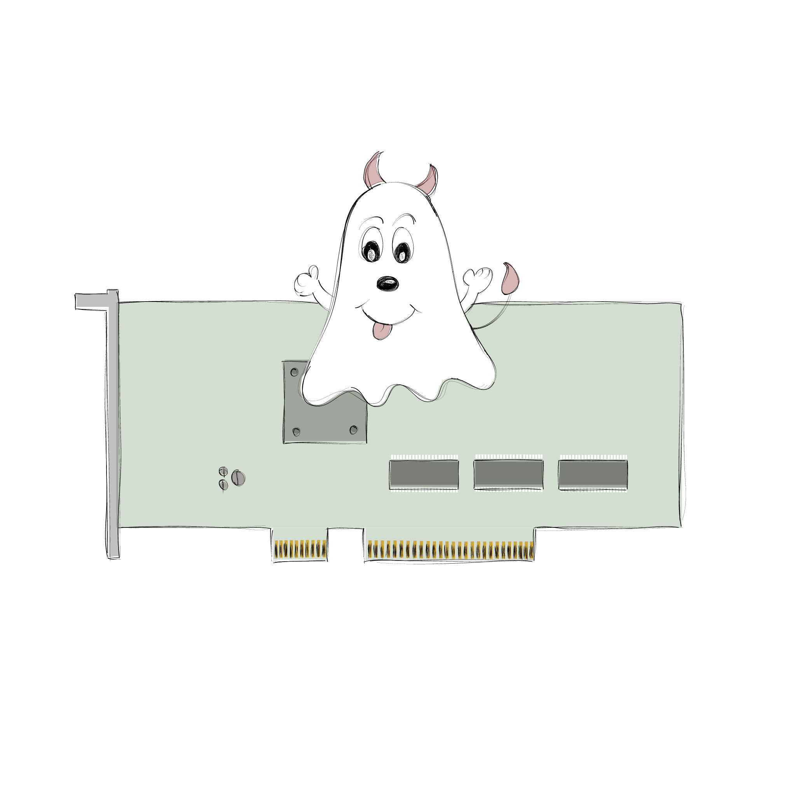
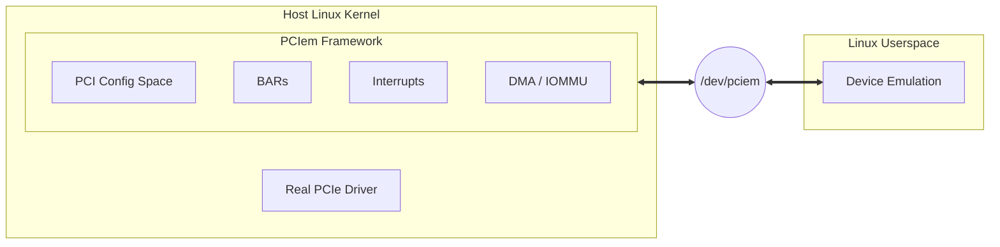

  

  A Linux kernel framework enabling synthetic userspace PCIe device emulation.

  https://cakehonolulu.github.io/introducing-pciem/

  https://cakehonolulu.github.io/docs/pciem/

## What is PCIem?

PCIem is a framework that creates virtual PCIe devices in the Linux kernel by leveraging a few novel techniques to populate synthetic cards as legitimate PCI devices to the host OS.

To brief what PCIem is: a framework for (Albeit not limited to) developing and testing PCIe device drivers without requiring actual hardware on the host.

## Comparison with libfvio-user

`PCIem` and `libfvio-user` are two different solutions for different needs, there may be confusion when comparing both so herein the differences (See [figure 1](#figure1) for more).

The main one is that `libvfio-user` usually relies on a client (That implements the `vfio-user` protocol), usually QEMU (Through KVM, using VM exits) to expose the emulated PCIe device to the guest. You write your `vfio` server (With a callback mechanism usually) which then interacts with the client.

What `PCIem` does instead is, expose the device *directly* on the host; no KVM, no guests, no virtual machines, nothing. The device appears on the host's PCIe bus as if it was physically connected.

| Feature | PCIem | libfvio-user |
| :--- | :--- | :--- |
| **Connection** | Device file (`/dev/pciem`) | UNIX Sockets (`vfio-user` protocol) |
| **Target driver runs on** | Host | Guest OS |
| **Emulated device runs on** | Userspace | Userspace |
| **Device accesses** | Direct (Within host) | Virtualized (Guest to Host) |

_Figure 1: Comparison between frameworks_

## Architecture

## Current Features

- **BAR creation**: Programmatically create and monitor BAR regions.
- **BAR MMIO tracing**: MMIO read/write detection and notification to avoid polling for accesses.
- **Interrupts support**: Legacy/MSI/MSI-X interrupt injection.
- **PCI capability framework**: PCI capabilities system (Linked-list underneath).
- **DMA system**: IOMMU-aware DMA accesses from/to userspace device.
  - **P2P support (Preliminar!)**: Peer-to-peer DMA between devices with whitelist-based access control.
- **Userspace**: Implement your PCIe devices _entirely_ in userspace.

# Examples

## NVME Controller with 1GB disk

The following example basically shows an NVME controller with 1GB of storage attached to. User can freely format, mount, create and remove files from the memory.

https://github.com/user-attachments/assets/6cc9ef8b-72f9-4a0b-b54e-6fbdde7c7589

## ProtoPCIem card

The card is programmed entirely in QEMU (State machine for the card, basically), which does all the userspace initialization and command handling from the real driver running in the host.

Can run software-rendered DOOM (Submits finished frames with DMA to the card which QEMU displays) and also simple OpenGL 1.X games (On the screenshots, tyr-glquake and xash3d; thanks to a custom OpenGL state machine implemented entirely in QEMU that software-renders the command lists and updates the internal state accordingly).

  
Screenshots

  

  

  

## License

Dual MIT/GPLv2 (`pciem_framework.c` and `protopciem_driver.c` due to using GPL symbols).

MIT (Rest).

## References

- Blog post: https://cakehonolulu.github.io/introducing-pciem/
- Documentation: https://cakehonolulu.github.io/docs/pciem/
- Hackernews post: https://news.ycombinator.com/item?id=46689065
- PCI Express specification: https://pcisig.com/specifications
